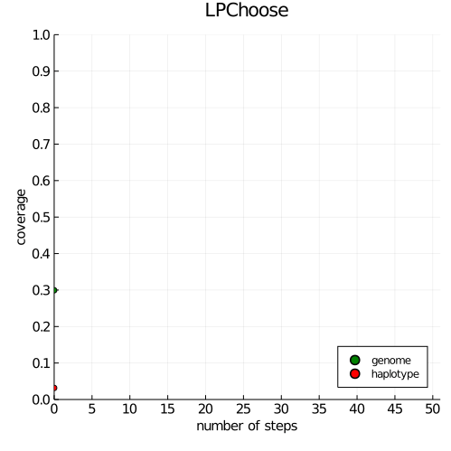
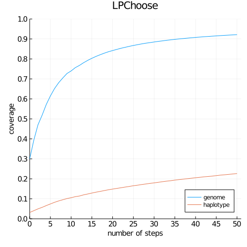
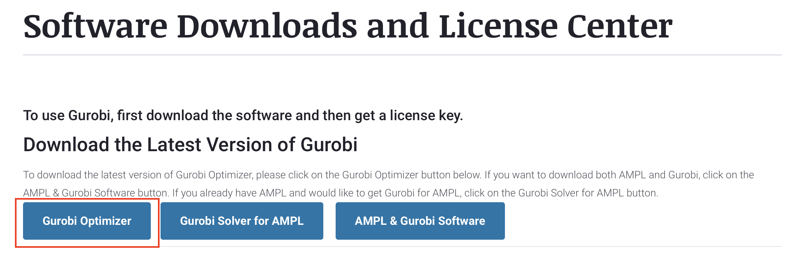

# LPChoose.jl

* **Authors**: Hao Cheng, Kuruvilla Joseph Abraham, Keyu Xu, Jinghui Li

Optimizing Sequencing Resources in Genotyped Livestock Populations by Linear Programming

> Hao Cheng, Keyu Xu, Kuruvilla Joseph Abraham, Optimizing Sequencing Resources in Genotyped Livestock Populations Using Linear Programming
bioRxiv 2020.06.29.179093; doi: https://doi.org/10.1101/2020.06.29.179093


### LPChoose function

    LPChoose(hapblock,budget=100,MAF=0.0;nsteps= (budget=="unlimited" ? 1 : Int(ceil(budget/2)))

* Choose animals for sequencing given haplotype information **hapblock** filterd by minor haplotype frequency **MAF** for two applications:
    * identify minimum number of animals containing all unique haplotypes in the population if `budget = "unlimited"`;
    * identify a fixed number of animals whose haplotypes include as large a proportion as possible of the haplotypes
      present in the population given a limited **budget**, defaulting to `100` (100 animals).
* A fast approximation may be used to speed up computation in practice to select a fixed number of animals. This approximation
  is performed by selecting **budget** animals in **nsteps**, defaulting to selecting 2 animals at each step. For example,
  we can select 2 animals in each step to select 100 animals with 100/2=50 steps.
* If a text file is provided for **hapblock**, the file format should be:
    * ```
      1,1,1,1,4       #ind1, hap1_1, hap1_1, hap2_1, hap2_4
      2,2,1,1,2       #ind2, hap1_2, hap1_1, hap2_1, hap2_2
      3,1,3,2,3       #ind3, hap1_1, hap1_3, hap2_2 hap2_3
      ```
    where individual IDs are in 1st column, maternal and paternal haplotypes for haplotype block 1 are in column 2-3,
    maternal and paternal haplotypes for haplotype block 2 are in column 4-5.

### 1st Application
```julia
julia> LPChoose("smalldata.txt","unlimited")

--------------INPUT----------------------------
#Animal:6000
#Unique Haplotypes:27473
Haplotype Frequency Summary Stats:
Length:         27473
Missing Count:  0
Mean:           0.007139
Minimum:        0.000167
1st Quartile:   0.000167
Median:         0.000500
3rd Quartile:   0.002000
Maximum:        0.353000

--------------QUALITY CONTROL-------------------
----------minor haplotype frequency: 0.0--------
#Animal:6000
#Unique Haplotypes:27473
Haplotype Frequency Summary Stats:
Length:         27473
Missing Count:  0
Mean:           0.007139
Minimum:        0.000167
1st Quartile:   0.000167
Median:         0.000500
3rd Quartile:   0.002000
Maximum:        0.353000

---------------1ST APPLICATION--------------------
-------identify minimum number of animals---------
-------containing all unique haplotypes----------
-----------RUN LINEAR PROGRAMMING-----------------

It took 10.922356 seconds (942.22 k allocations: 121.610 MiB)

The minimum number of selected animals is: 4135
IDs for identified animals were saved in identified_animals.txt.

---------------------DONE-------------------------

```

### 2nd application
```julia
julia> LPChoose("smalldata.txt",10);

--------------INPUT----------------------------
#Animal:6000
#Unique Haplotypes:27473
Haplotype Frequency Summary Stats:
Length:         27473
Missing Count:  0
Mean:           0.007139
Minimum:        0.000167
1st Quartile:   0.000167
Median:         0.000500
3rd Quartile:   0.002000
Maximum:        0.353000

--------------QUALITY CONTROL-------------------
----------minor haplotype frequency: 0.0--------
#Animal:6000
#Unique Haplotypes:27473
Haplotype Frequency Summary Stats:
Length:         27473
Missing Count:  0
Mean:           0.007139
Minimum:        0.000167
1st Quartile:   0.000167
Median:         0.000500
3rd Quartile:   0.002000
Maximum:        0.353000

---------------2ND APPLICATION--------------------
------------identify best 10 animals--------------
--representing maximum proportions of haplotypes--
-----------RUN LINEAR PROGRAMMING-----------------

identifying most representative animals ...100%|████████| Time: 0:00:23

0.05023113602446039 of the unique haplotypes in the population is covered.
0.5006245666272382 of the genome in the population is covered.

IDs for identified animals were saved in identified_animals.txt.

---------------------DONE-------------------------

```

### allow preselected animals

```julia
julia> animals_selected=[1,10,12,13,20,25]
julia> LPChoose("smalldata.txt",10,preselected_animals=animals_selected);

--------------INPUT----------------------------
#Animal:6000
#Unique Haplotypes:27473
Haplotype Frequency Summary Stats:
Length:         27473
Missing Count:  0
Mean:           0.007139
Minimum:        0.000167
1st Quartile:   0.000167
Median:         0.000500
3rd Quartile:   0.002000
Maximum:        0.353000

--------------QUALITY CONTROL-------------------
----------minor haplotype frequency: 0.0--------
#Animal:6000
#Unique Haplotypes:27473
Haplotype Frequency Summary Stats:
Length:         27473
Missing Count:  0
Mean:           0.007139
Minimum:        0.000167
1st Quartile:   0.000167
Median:         0.000500
3rd Quartile:   0.002000
Maximum:        0.353000

---------------2ND APPLICATION--------------------
------------identify best 10 animals--------------
--representing maximum proportions of haplotypes--
-----------RUN LINEAR PROGRAMMING-----------------

identifying most representative animals ...100%|████████| Time: 0:00:23

0.07884104393404434 of the unique haplotypes in the population is covered.
0.619383149107422 of the genome in the population is covered.


0.0440448759113059 of the unique haplotypes in the population (exclude preselected animals) is covered.
0.47576847092310137 of the genome in the population (exclude preselected animals) is covered.

IDs for identified animals were saved in identified_animals.txt.

---------------------DONE-------------------------

```

### plotting

#### Making animations (GIF) using output files

```julia
using Plots, DelimitedFiles
genome_coverage    = "genome_coverage.txt"
haplotype_coverage = "haplotype_coverage.txt"
steps  = readdlm(genome_coverage,',',header=true)[1][:,1]
g      = readdlm(genome_coverage,',',header=true)[1][:,2]
h      = readdlm(haplotype_coverage,',',header=true)[1][:,2]
nsteps = length(g)

plot(size=(500,500),
     xlim=(0,nsteps),ylim=(0,1),
     xaxis = (font(10), 0:5:nsteps),yaxis = (font(10), 0:0.1:1),
     title="LPChoose",
     ylabel = "coverage",xlabel = "number of steps",
     legend=:bottomright
)

anim = @animate for i in 1:length(g)
    labelg = (i == 1) ? "genome" : ""
    labelh = (i == 1) ? "haplotype" : ""
    plot!(steps[i:i],g[i:i],seriestype=:scatter,markercolor=:green,label=labelg)
    plot!(steps[i:i],h[i:i],seriestype=:scatter,markercolor=:red,label=labelh)
end
gif(anim, "anim_fps5.gif", fps = 5)
```


#### Making a simple line plot

```julia
using Plots, DelimitedFiles
genome_coverage    = "genome_coverage.txt"
haplotype_coverage = "haplotype_coverage.txt"
steps  = readdlm(genome_coverage,',',header=true)[1][:,1]
g      = readdlm(genome_coverage,',',header=true)[1][:,2]
h      = readdlm(haplotype_coverage,',',header=true)[1][:,2]
nsteps = length(g)

line_plot=plot(size=(500,500),
     xlim=(0,nsteps),ylim=(0,1),
     xaxis = (font(10), 0:5:nsteps),yaxis = (font(10), 0:0.1:1),
     title="LPChoose",
     ylabel = "coverage",xlabel = "number of steps",
     legend=:bottomright
)

plot!(steps,g,markercolor=:green,label="genome")
plot!(steps,h,markercolor=:red,label="haplotype")
savefig(line_plot,"line_plot.png")
```


### Use Gurobi in Julia 

Gurobi is a commercial mathematical optimization solver, which provides feasible solutions much faster than GLPK for Application 1 of LPChoose. Gurobi offers a free license for acedememic use, and this tutorial illustrates how to install it and use it in Julia.

#### Install Gurobi optimizer

1. Download Gurobi from https://www.gurobi.com/downloads/. 

2. Select the version "Gurobi Optimizer". 


3. Download and install the proper version of Gurobi for your computer after creating an acedemic account.

#### Download an acedemic license

Log in using your account on the homepage and request a license (don't change the downloading). Follow the instructions to activate Gurobi.

#### Download Gurobi in Julia

There is a Gurobi wrapper for Julia so that we can use Gurobi in Julia. After installing Gurobi and the license, you can download the Gurobi package in Julia as follows:

```julia
using Pkg
Pkg.add("Gurobi")
```
Now Gurobi is ready in Julia for use!
